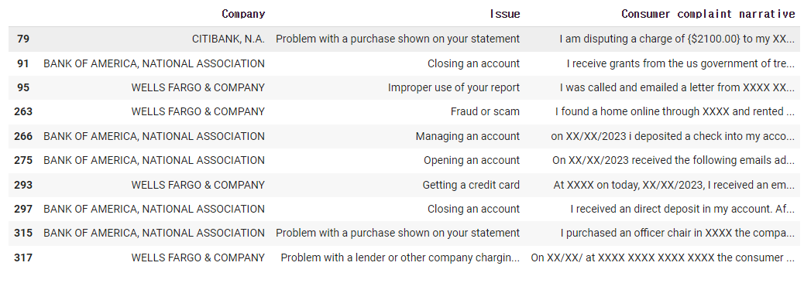
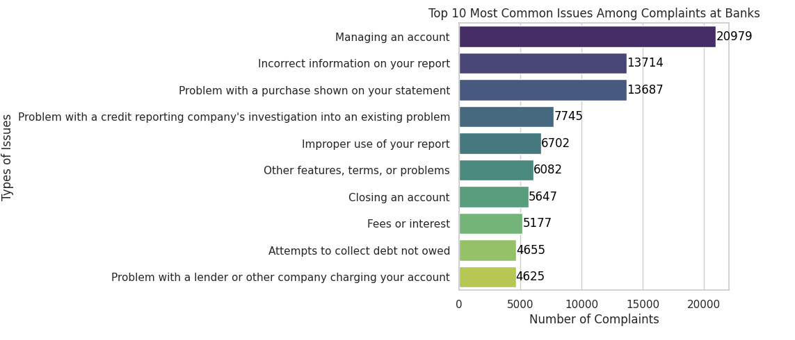
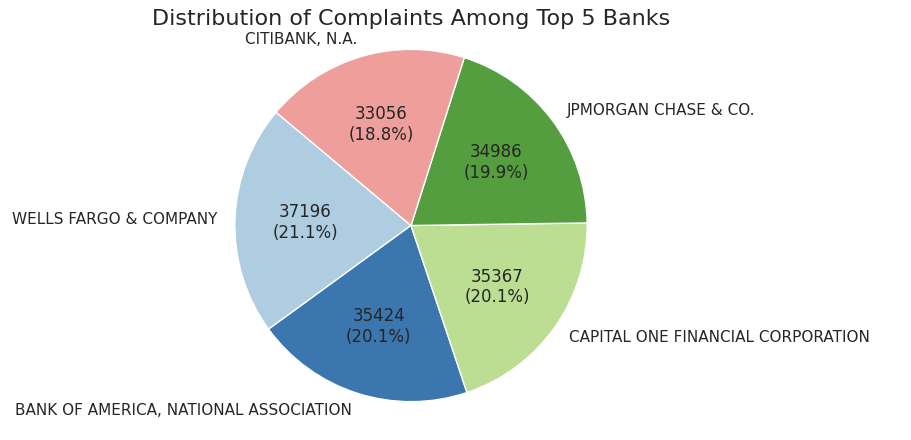
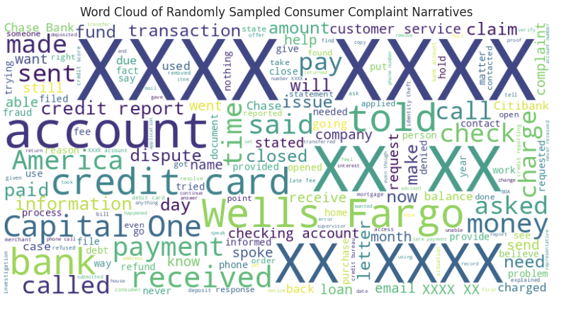

# Generative AI Practicum Project - GWU MSBA Fall 2023 Model Card
## Generating datasets for validating complaint-classification NLP Models

### Basic Information

* **Person or organization developing model**: GWU Wells Fargo Generative AI Team (Stephanie Palanca, Joon Kyu Hong, Kathleen McQuiddy, Ian Kang) 
* **Model date**: December, 2023
* **Model version**: 1.0
* **License**: MIT
* **Model implementation codes**: [final_codes](final_codes)

### Intended Use

* **Business Value**: Improving the accuracy of complaint classification models, enabling financial institutions and regulators to better understand and address consumer concerns.
* **Objective**: Providing practical experience in LLMs and Prompt Engineering projects for educational purposes.
* **Intended Users** : Wells Fargo Team, Patrick Hall, and GWU Students in DNSC 6317
* **Additional Information** : Valuable educational resource for GWU students.
  
### Data

* Data dictionary: This dataset captures consumer complaints submitted to the Consumer Financial Protection Bureau (CFPB), detailing information such as the date received, type of financial product involved, specific issues raised, and the company's response. It provides insights into consumer experiences with financial products and services, aiding in the analysis of industry trends and regulatory oversight.

| Field name                   | Description                                                                                                                                                                                | Measurement Level   |
|------------------------------|--------------------------------------------------------------------------------------------------------------------------------------------------------------------------------------------|---------------------|
| Date received                | The date the CFPB received the complaint. For example, “05/25/2013.”                                                                                                                      | Ordinal             |
| Product                      | The type of product the consumer identified in the complaint. For example, “Checking or savings account” or “Student loan.”                                                                 | Nominal             |
| Sub-product                  | The type of sub-product the consumer identified in the complaint. For example, “Checking account” or “Private student loan.”                                                                 | Nominal             |
| Issue                        | The issue the consumer identified in the complaint. For example, “Managing an account” or “Struggling to repay your loan.”                                                                   | Nominal             |
| Sub-issue                    | The sub-issue the consumer identified in the complaint. For example, “Deposits and withdrawals” or “Problem lowering your monthly payments.”                                              | Nominal             |
| Consumer complaint narrative | Consumer complaint narrative is the consumer-submitted description of “what happened” from the complaint. Consumers must opt-in to share their narrative.                                    | Text                |
| Company public response      | The company’s optional, public-facing response to a consumer’s complaint. Companies can choose to select a response from a pre-set list of options that will be posted on the public database. | Nominal             |
| Company                      | The complaint is about this company. For example, “ABC Bank.”                                                                                                                               | Nominal             |
| State                        | The state of the mailing address provided by the consumer.                                                                                                                                  | Nominal             |
| ZIP code                     | The mailing ZIP code provided by the consumer. This field may: i) include the first five digits of a ZIP code; ii) include the first three digits of a ZIP code (if the consumer consented to publication of their complaint narrative); or iii) be blank (if ZIP codes have been submitted with non-numeric values, if there are less than 20,000 people in a given ZIP code, or if the complaint has an address outside of the United States). | Numeric             |
| Tags                         | Data that supports easier searching and sorting of complaints submitted by or on behalf of consumers. For example, complaints where the submitter reports the age of the consumer as 62 years or older are tagged “Older American.” Complaints submitted by or on behalf of a servicemember or the spouse or dependent of a servicemember are tagged “Servicemember.” Servicemember includes anyone who is active duty, National Guard, or Reservist, as well as anyone who previously served and is a veteran or retiree. | Nominal             |
| Consumer consent provided?  | Identifies whether the consumer opted in to publish their complaint narrative. We do not publish the narrative unless the consumer consents, and consumers can opt-out at any time.              | Binary              |
| Submitted via                | How the complaint was submitted to the CFPB. For example, “Web” or “Phone.”                                                                                                                 | Nominal             |
| Date sent to company         | The date the CFPB sent the complaint to the company.                                                                                                                                       | Ordinal             |
| Company response to consumer | This is how the company responded. For example, “Closed with explanation.”                                                                                                                  | Nominal             |
| Timely response?             | Whether the company gave a timely response. For example, “Yes” or “No.”                                                                                                                     | Binary              |
| Consumer disputed?           | Whether the consumer disputed the company’s response.                                                                                                                                      | Binary              |
| Complaint ID                 | The unique identification number for a complaint.                                                                                                                                          | Nominal             |

* **Source of training data**: Consumer Finance Protection Beauru (suggested by the Wells Fago team)
* **Number of rows in training data**:
  * training  rows: 176029 rows after removing null values.

* **Column(s) used as target(s) in the final model**: 'Consumer complaint narrative'
  
### Model Details 

#### Type of model 1: Llama 2 7B (API) - Main Model
* **Software used to implement the model**:
* **Version of the modeling software**: 

#### Type of model 2: Llama 2 7B (Chat)
* **Software used to implement the model**: Python, Together, langchain , Llama 2 7B
* **Version of the modeling software**: 3.10.2, 1.0.0 , 0.0.327, 2.7b

#### Type of model 3: Falcon
* **Software used to implement the model**: 
* **Version of the modeling software**: 

#### Type of model 4: Red Pajama
* **Software used to implement the model**: 
* **Version of the modeling software**: 

#### Type of model 5: Red Pajama
* **Software used to implement the model**: 
* **Version of the modeling software**:

#### Type of model 6: Mistral
* **Software used to implement the model**: 
* **Version of the modeling software**: 

#### Type of model 7: GPT 3.5 Turbo
* **Software used to implement the model**: Python, openai
* **Version of the modeling software**: 3.10.2, 3.5
  
### Exploratory Data Analysis 

#### Table of sample complaints
* **An example of complaints dataset with issues and consumer complaint narrative.**
  

#### Bar Chart 
* **It highlights the ten most prevalent issues identified within complaints filed against banks.**
  

#### Pie Chart
* **It illustrates the distribution of complaints among the top five banks.**
  

#### Common Words from Complaints
* **A visual representation using a word cloud of randomly sampled consumer complaint narratives.**
  

### Methodology 

* **Basic process of complaint generation using a large language model**:

  * Tokenization: The first step is to convert the input text into tokens. Tokenization is the process of breaking down the text into individual words or subwords. Subwords are smaller units of text that can be combined to form words. For example, the word "unrecognizable" can be broken down into its subwords - "un-rec-og-niz-able".

  * Embeddings: Once the text has been tokenized, the next step is to create embeddings for each token. Embeddings are vector representations of the tokens that capture their semantic meaning. The embeddings are learned during the training process and are used to feed the input text into the model.

  * Encoding: The embeddings are then fed into the encoder, which is a stack of transformer layers. The transformer layers use self-attention mechanisms to process the input sequence of tokens and generate a continuous representation of the input text. The output of the encoder is a sequence of hidden states that capture the context and meaning of the input text.

  * Decoding: The decoder is responsible for generating the output text. The decoder also consists of a stack of transformer layers, and it takes the output of the encoder as input. The decoder generates the output text one token at a time, using a process called autoregressive decoding. At each step, the decoder generates a probability distribution over the possible tokens that could come next in the sequence, and it selects the most likely token to add to the output sequence.

  * Generation: The final step is to generate the output text. The decoder generates the output text one token at a time, using the probability distribution generated in the previous step. The output text is then passed through a linear layer and a softmax activation function to generate a probability distribution over the possible tokens. The model then selects the most likely token to add to the output sequence.

  * Training: During training, the model is trained to minimize a loss function that measures the difference between the predicted output and the actual output. The model is trained on a large corpus of text data, and the loss function is calculated for each token in the output sequence.

* **There are some other important components of LLaMA 2**:
  * A combination of a transformer encoder and a recurrent neural network (RNN) decoder,
  * LLaMA-2 has a smaller model size than other LLMs, with around 120 million parameters
  * LLaMA-2 is trained on a combination of masked language modeling, next sentence prediction, and a few other tasks
  
* **Synthesize Complaints**:
   * The initial exploratory analysis identified three types of complaints:
      * Complaints that are generally well written - DESIRABLE
      * Complaints with very poor grammar and punctuation - PROBLEMATIC
      * Complaints with frivolous, unrelated information - PROBLEMATIC
     
    * Based on this, we had this idea: Have we focus on just the invariance and robustness aspects related to these “problematic” complaints and focus on questions like “Can the right LLM with the right prompt ‘clean up’ these problematic           complaints?” In other words, can an LLM correct the poor grammar and punctuation without changing the meaning (invariance) and can an LLM identify the frivolous content of a complaint (robustness)?

   * Different types of prompts:
       Prompt for Robustness Testing, Prompt for Equal Complaint Synthesis (MFT), Prompt for Harshness Modification (Direction):

### Model Performance 

### Model Evaluation 

### Ethical Concerns 

### Risk Considerations 
* **Describe potential negative impacts of using your group’s best model** : 
  *  Consider math or software problems:

  * Consider real-world risks: who, what, when and how?: 

* **Describe potential uncertainties relating to the impacts of using your group’s best model**:
  * Consider math or software problems: 

   * Consider real-world risks: who, what, when and how? 
    
* **Describe any unexpected or results encountered during training**:
  
* **Metrics used to evaluate the best remediated model**:
